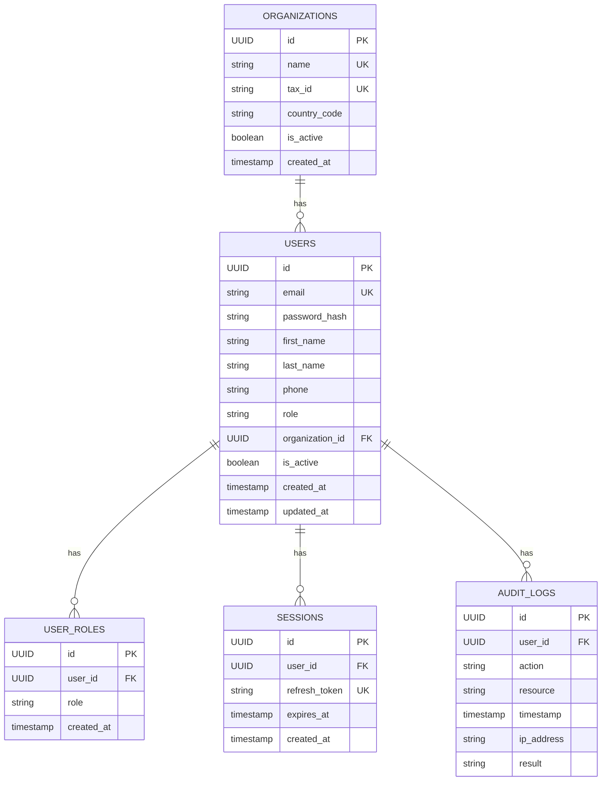

# Database Schema

Mermaid ER diagram of foundational tables:

Indexes:
- `users(email)`, `users(organization_id)`
- `audit_logs(timestamp)`
- `sessions(expires_at)`

Constraints:
- Unique: `organizations.name`, `organizations.tax_id`, `users.email`, `sessions.refresh_token`
- Composite Unique: `(user_roles.user_id, user_roles.role)`
- FKs with cascade rules per V1 migration
- Audit logs immutable (DB trigger prevents updates/deletes)
